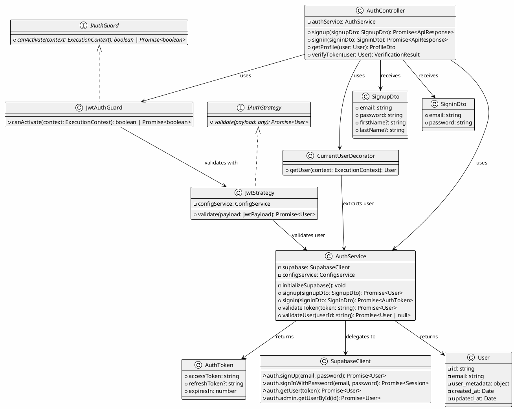
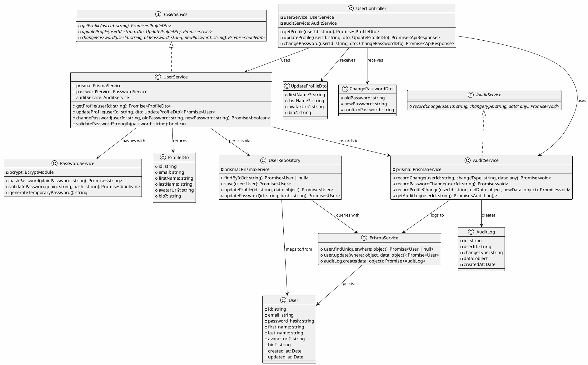
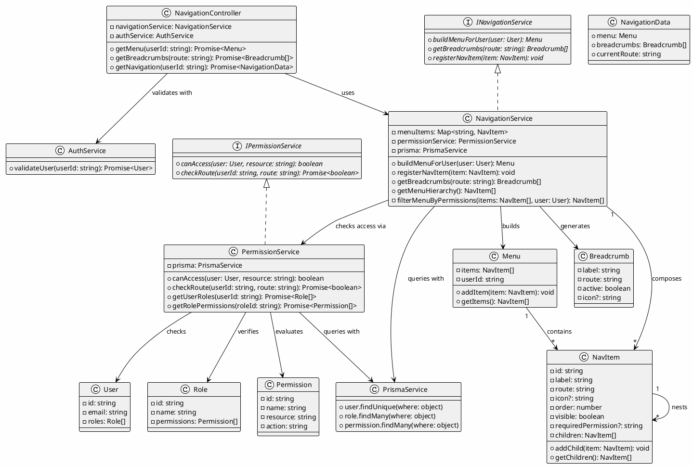
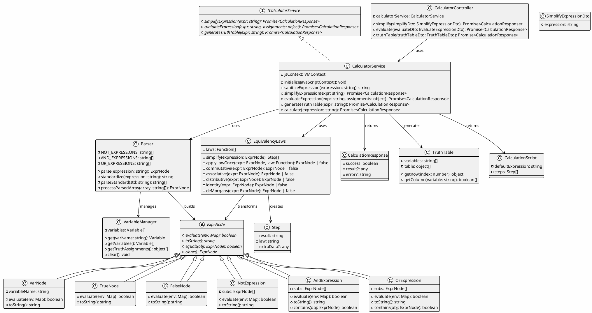
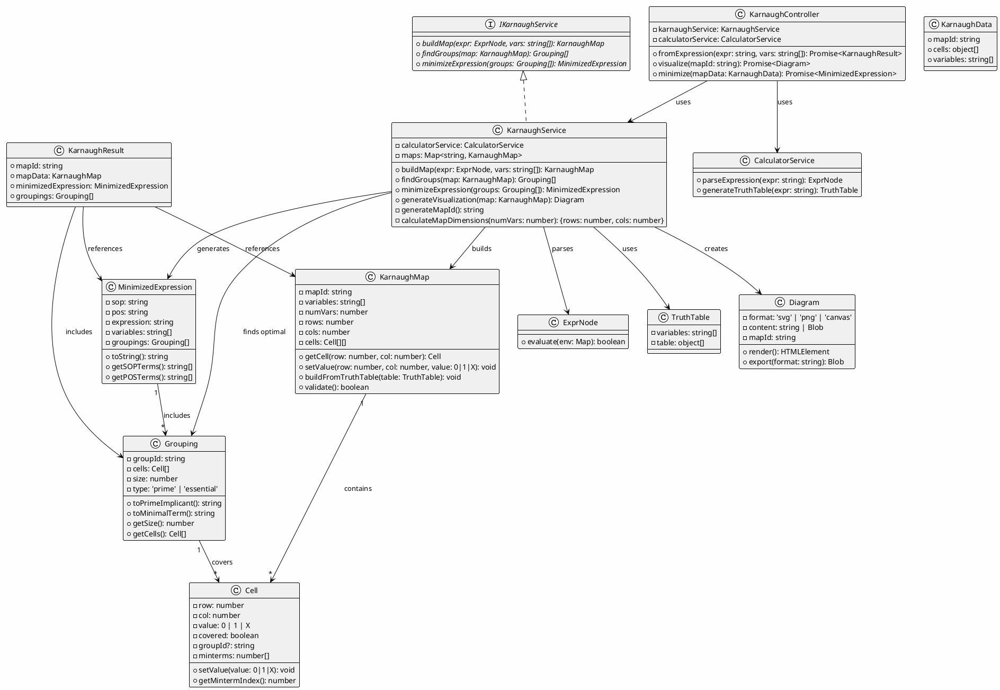
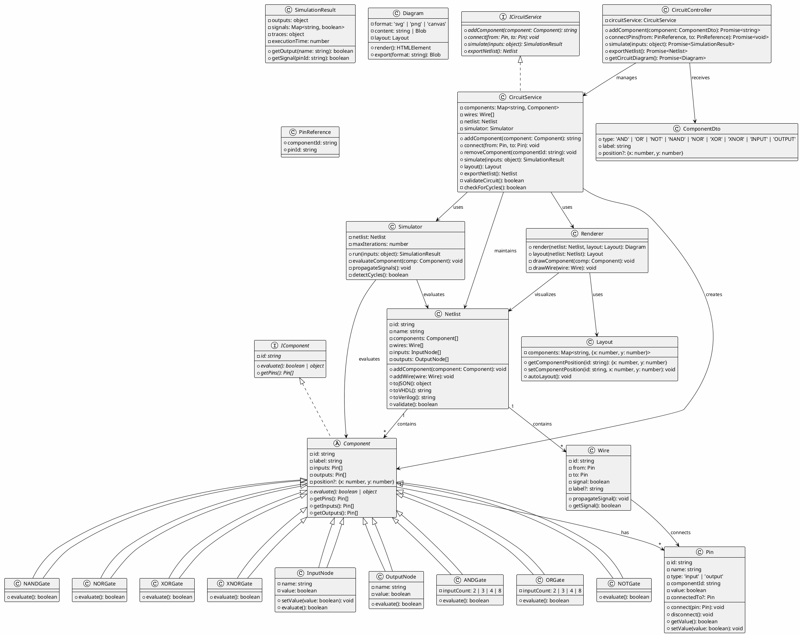

# Bitwise-Server - UML Class Diagrams

This document contains comprehensive UML class diagrams for all six features in the Bitwise-Server project with proper class relationships including inheritance, composition, dependency, and interfaces.

**Note:** Use PlantUML to render these diagrams. Copy the PlantUML code into [PlantUML Online Editor](http://www.plantuml.com/plantuml/uml/)

---

## Table of Contents

1. [User Registration](#1-user-registration)
2. [Edit Information](#2-edit-information)
3. [Navigation Tools](#3-navigation-tools)
4. [Boolean Calculator](#4-boolean-calculator)
5. [Karnaugh Map](#5-karnaugh-map)
6. [Circuit Diagram](#6-circuit-diagram)

---

## 1. User Registration

**Status:** ✅ Implemented  
**Files:** `src/auth/*`  
**Dependencies:** Supabase, Passport.js, JWT

### PlantUML Class Diagram



### Key Relationships

| Relationship Type | From | To | Meaning |
|---|---|---|---|
| **uses** | AuthController | AuthService | Controller depends on service |
| **delegates to** | AuthService | SupabaseClient | Service delegates auth to external provider |
| **implements** | JwtAuthGuard | IAuthGuard | Guard implements authentication interface |
| **validates with** | JwtAuthGuard | JwtStrategy | Guard uses strategy to validate tokens |
| **returns** | AuthService | User | Service returns user object after authentication |

### Methods & Responsibilities

**AuthController:**
- Routes HTTP requests to appropriate service methods
- Extracts DTOs from request bodies
- Returns standardized API responses

**AuthService:**
- Initializes Supabase client with configuration
- Handles signup/signin logic
- Validates JWT tokens
- Returns authenticated users

**JwtAuthGuard:**
- Protects routes with @UseGuards(JwtAuthGuard)
- Validates JWT presence in request headers
- Delegates to JwtStrategy for token validation

**JwtStrategy:**
- Decodes JWT payload
- Validates token signature
- Calls AuthService.validateUser()

---

## 2. Edit Information (User Profile)

**Status:** ⚠️ Partially Implemented  
**Files:** `src/user/*`, `src/auth/*`  
**Dependencies:** Prisma ORM, bcrypt

### PlantUML Class Diagram



### Key Relationships

| Relationship Type | From | To | Meaning |
|---|---|---|---|
| **implements** | UserService | IUserService | Service implements the interface contract |
| **uses** | UserController | UserService | Controller depends on service |
| **persists via** | UserService | UserRepository | Service uses repository pattern |
| **hashes with** | UserService | PasswordService | Service delegates password hashing |
| **queries with** | UserRepository | PrismaService | Repository uses ORM for DB access |
| **maps to/from** | UserRepository | User | Repository maps data to domain model |

### Methods & Responsibilities

**UserController:**
- HTTP GET /api/user/:userId → retrieves profile
- HTTP PATCH /api/user/:userId → updates profile
- HTTP POST /api/user/change-password → changes password

**UserService:**
- Implements business logic for user operations
- Validates password strength and changes
- Triggers audit logging on changes

**UserRepository:**
- Database access layer
- Single responsibility: query/persist users

**PasswordService:**
- Bcrypt password hashing
- Password validation with salt verification

**AuditService:**
- Logs all user profile changes
- Maintains audit trail for compliance

---

## 3. Navigation Tools

**Status:** ❌ Not Implemented  
**Recommended Files:** `src/navigation/*`  
**Dependencies:** None (core framework)

### PlantUML Class Diagram



### Key Relationships

| Relationship Type | From | To | Meaning |
|---|---|---|---|
| **implements** | NavigationService | INavigationService | Service implements contract |
| **uses** | NavigationController | NavigationService | Controller depends on service |
| **checks access via** | NavigationService | PermissionService | Service delegates permission checks |
| **composes** | NavigationService | NavItem | Service aggregates menu items |
| **nests** | NavItem | NavItem | Hierarchical menu structure |
| **contains** | Menu | NavItem | Menu is container for items |

### Methods & Responsibilities

**NavigationController:**
- HTTP GET /api/navigation/menu/:userId → retrieves user's menu
- HTTP GET /api/navigation/breadcrumbs → gets breadcrumb trail
- HTTP GET /api/navigation/full → complete navigation data

**NavigationService:**
- Builds dynamic menus based on user permissions
- Maintains navigation item registry
- Generates breadcrumb trails for routes

**PermissionService:**
- Checks if user has access to resources
- Validates route permissions
- Retrieves user roles and permissions

**NavItem:**
- Represents individual menu item
- Supports nested hierarchies
- Stores permission requirements

---

## 4. Boolean Calculator

**Status:** ✅ Implemented  
**Files:** `src/calculator/*`  
**Dependencies:** JavaScript VM module

### PlantUML Class Diagram



### Key Relationships

| Relationship Type | From | To | Meaning |
|---|---|---|---|
| **implements** | CalculatorService | ICalculatorService | Service implements contract |
| **uses** | CalculatorService | Parser | Service uses parser for AST building |
| **builds** | Parser | ExprNode | Parser constructs expression tree |
| **extends** | VarNode | ExprNode | Specialization of abstract expression |
| **transforms** | EquivalencyLaws | ExprNode | Laws convert expressions |
| **generates** | CalculatorService | TruthTable | Service produces truth tables |

### Methods & Responsibilities

**CalculatorController:**
- HTTP POST /api/calculator/simplify → simplifies Boolean expression
- HTTP POST /api/calculator/evaluate → evaluates with assignments
- HTTP POST /api/calculator/truth-table → generates truth table

**CalculatorService:**
- Initializes JavaScript VM context with Boolean algebra engine
- Sanitizes input expressions
- Coordinates parsing and simplification
- Generates truth tables

**Parser:**
- Parses string expressions into AST
- Tokenizes and standardizes notation
- Builds expression node tree

**ExprNode (Abstract):**
- Base class for all Boolean expressions
- Defines evaluation and string representation

**VarNode, TrueNode, FalseNode:**
- Leaf nodes of expression tree
- Base expressions that can be combined

**NotExpression, AndExpression, OrExpression:**
- Operator nodes
- Contain sub-expressions
- Support Boolean operations

**EquivalencyLaws:**
- Implements Boolean algebra simplification laws
- Applies laws iteratively until minimal form
- Laws: commutative, associative, distributive, absorption, De Morgan's, etc.

---

## 5. Karnaugh Map

**Status:** ❌ Not Implemented  
**Recommended Files:** `src/karnaugh/*`  
**Dependencies:** Calculator service (parser)

### PlantUML Class Diagram



### Key Relationships

| Relationship Type | From | To | Meaning |
|---|---|---|---|
| **implements** | KarnaughService | IKarnaughService | Service implements contract |
| **uses** | KarnaughService | KarnaughMap | Service manages map instances |
| **builds** | KarnaughService | KarnaughMap | Service creates K-map structure |
| **contains** | KarnaughMap | Cell | Map is aggregation of cells |
| **covers** | Grouping | Cell | Grouping aggregates cells |
| **includes** | MinimizedExpression | Grouping | Result contains groupings |

### Methods & Responsibilities

**KarnaughController:**
- HTTP POST /api/karnaugh/build → creates K-map from expression
- HTTP GET /api/karnaugh/visualize/:mapId → renders diagram
- HTTP POST /api/karnaugh/minimize → finds minimized expression

**KarnaughService:**
- Converts Boolean expressions to K-maps
- Finds optimal cell groupings (prime implicants)
- Generates minimized SOP/POS expressions
- Creates SVG visualizations

**KarnaughMap:**
- Maintains 2D grid of cells (2-var to 5-var support)
- Maps truth values to grid positions
- Calculates row/column labels based on Gray code

**Cell:**
- Represents single K-map cell
- Stores value (0, 1, or don't-care)
- Tracks group membership

**Grouping:**
- Represents group of adjacent cells (1, 2, 4, 8, 16...)
- Converts to Boolean term (SOP/POS)
- Marked as essential or prime

**MinimizedExpression:**
- Result of K-map minimization
- Stores both SOP and POS forms
- Includes all groupings used

---

## 6. Circuit Diagram

**Status:** ❌ Not Implemented  
**Recommended Files:** `src/circuit/*`  
**Dependencies:** None (core framework)

### PlantUML Class Diagram



### Key Relationships

| Relationship Type | From | To | Meaning |
|---|---|---|---|
| **implements** | CircuitService | ICircuitService | Service implements contract |
| **extends** | ANDGate | Component | Specific gate type specialization |
| **manages** | CircuitController | CircuitService | Controller orchestrates |
| **creates** | CircuitService | Component | Service factory for gates |
| **contains** | Netlist | Component | Netlist is container |
| **contains** | Netlist | Wire | Netlist holds connections |
| **connects** | Wire | Pin | Wire links pins |
| **has** | Component | Pin | Component owns pins |
| **uses** | CircuitService | Simulator | Service delegates execution |
| **uses** | CircuitService | Renderer | Service creates visualizations |

### Methods & Responsibilities

**CircuitController:**
- HTTP POST /api/circuit/add-component → adds gate/input/output
- HTTP POST /api/circuit/connect → creates wire between pins
- HTTP POST /api/circuit/simulate → runs simulation
- HTTP GET /api/circuit/export → exports netlist
- HTTP GET /api/circuit/diagram → renders SVG/canvas

**CircuitService:**
- Manages component and wire collections
- Validates circuit topology (no cycles, all connections)
- Coordinates simulation execution
- Exports netlist to VHDL/Verilog

**Component (Abstract):**
- Base class for all logic elements
- Stores pins (inputs/outputs)
- Defines evaluation behavior

**Gate Classes (ANDGate, ORGate, etc.):**
- Implement specific Boolean logic
- Accept variable input counts
- Return single boolean output

**InputNode / OutputNode:**
- User-controllable inputs
- Circuit output collectors
- Special component types

**Pin:**
- Represents connection point
- Stores current signal value
- Maintains connection to other pins

**Wire:**
- Represents physical connection
- Transfers signal between pins
- Labels can annotate signals

**Netlist:**
- Complete circuit representation
- Serializable to JSON/VHDL/Verilog
- Validates connectivity and logic

**Simulator:**
- Event-driven signal propagation
- Evaluates components iteratively
- Detects combinatorial vs sequential behavior

**Renderer:**
- Converts netlist to visual diagram
- Positions components and routes wires
- Exports to SVG or raster formats

---

## Summary Comparison Table

| Feature | Status | Inheritance | Composition | Interfaces | Key Relationships |
|---------|--------|-------------|-------------|-----------|---|
| **User Registration** | ✅ | N/A | AuthService→SupabaseClient | IAuthGuard, IAuthStrategy | uses, delegates, implements |
| **Edit Information** | ⚠️ | N/A | UserService→UserRepository→PrismaService | IUserService, IAuditService | uses, implements, persists |
| **Navigation Tools** | ❌ | N/A | NavItem→NavItem (hierarchy) | INavigationService, IPermissionService | implements, nests, composes |
| **Boolean Calculator** | ✅ | ExprNode extends (VarNode, TrueNode, etc.) | CalculatorService→Parser→ExprNode | ICalculatorService | extends, uses, builds, transforms |
| **Karnaugh Map** | ❌ | N/A | KarnaughService→KarnaughMap→Cell | IKarnaughService | builds, contains, covers |
| **Circuit Diagram** | ❌ | Component extends (ANDGate, ORGate, etc.) | CircuitService→Component, Wire, Netlist | ICircuitService, IComponent | extends, contains, implements |

---

## Design Patterns Used

### 1. **Service Layer Pattern**
All features use a layered architecture:
```
Controller → Service → Repository/External Service → Database/API
```

### 2. **Dependency Injection**
NestJS provides constructor-based DI:
```typescript
constructor(private service: ServiceClass) {}
```

### 3. **Repository Pattern**
Data access layer separates business logic from persistence:
```typescript
// UserService uses UserRepository
// Repository uses PrismaService
// This isolates DB changes from business logic
```

### 4. **Strategy Pattern**
JWT Authentication uses strategies:
```
JwtAuthGuard uses JwtStrategy for token validation
Multiple strategies (OAuth, API Key, etc.) can swap in
```

### 5. **Factory Pattern**
Circuit service creates components:
```typescript
const gate = circuitService.addComponent(new ANDGate())
```

### 6. **Composite Pattern**
Navigation uses hierarchical structure:
```
Menu contains NavItem[]
NavItem contains NavItem[] (children)
```

### 7. **Visitor Pattern**
Boolean calculator uses law application:
```
EquivalencyLaws visits each ExprNode
Applies transformations recursively
```

### 8. **Observer Pattern**
Circuit simulation uses signal propagation:
```
Wire propagates signal to connected Pin
Pin notifies dependent components
```

---

## Relationship Legend

| Symbol | Meaning |
|--------|---------|
| `→` | uses / depends on |
| `→\|` | inherits from (extends) |
| `◇→` | contains (composition) |
| `◇--→` | aggregates (weak composition) |
| `..→` | implements interface |
| `--→` | associates with |

---

## Export & Usage

### To Render in PlantUML Online:
1. Copy any PlantUML code block
2. Visit http://www.plantuml.com/plantuml/uml/
3. Paste and render

### To Generate PNG locally:
```bash
# Install PlantUML
npm install -g plantuml

# Generate PNG
plantuml CLASS_DIAGRAMS_UML.md -o ../diagrams/

# Or use Docker
docker run -v $(pwd):/workspace -w /workspace plantuml/plantuml:latest -png CLASS_DIAGRAMS_UML.md
```

### To use in documentation:
- Export as SVG for web
- Export as PNG for presentations
- Keep .md for version control

---

**Last Updated:** October 20, 2025  
**Project:** Bitwise-Server  
**Repository:** One-Team-One-Goal/bitwise-server  
**Branch:** development

